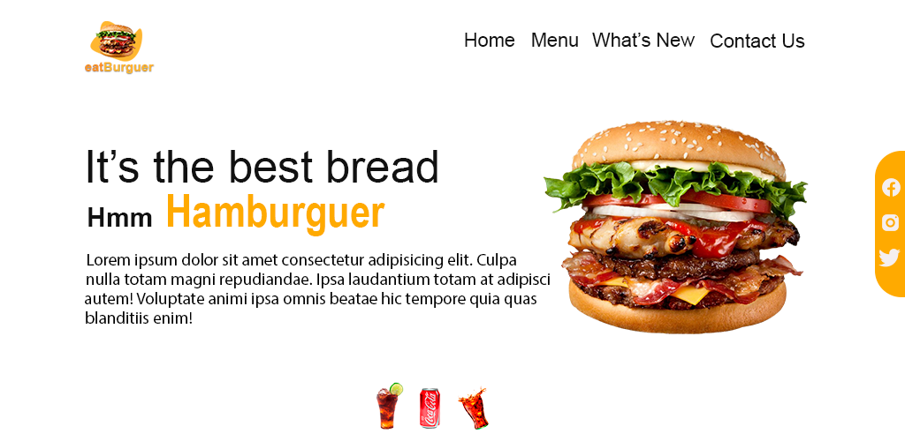

<h1 align="center">
    
    
EatBurguer - FastFood

</h1>

## About

It's a simple landpages, made to learn html5, css3 and javascript.
***
***

***
- EatBurger <a href="https://josuepanzo.github.io/eatHalth/" target="_blank">Go to Site</a>

***
***
## 🔨 Tools

- Html5
- Css3
- Javascript

***
***
## ❄ How Contribute
***
***Clone project***
***
$ git clone https://github.com/josuepanzo/eatHalth/

***
## 🧧 Licenses
***
This project is under the **MIT License**. See the file **LICENSE** for more details.

